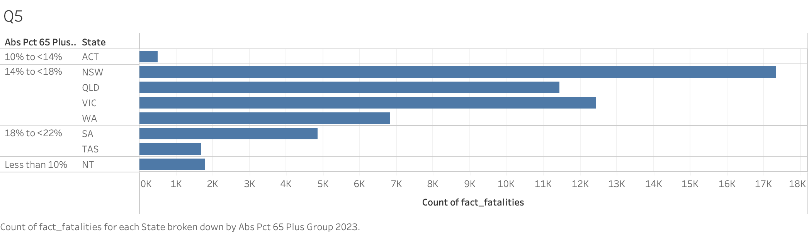

# Data Warehousing Project 1

| Name       | Student Number |
| ---------- | -------------- |
| Wendy Wang | 23904899       |
| Xiang Li   | 23921151       |

---

## Introduction

### Background and Objectives

Traffic-accident analysis plays a critical role in enhancing public safety, reducing economic losses, and guiding evidence-based policymaking.

The primary goals of this project are two fold. First, we aim to **design and implement a data warehouse** that supports fast, flexible querying across multiple dimensions. Second, we will **apply association-rule mining techniques** to uncover hidden patterns that link environmental conditions, vehicle characteristics, and human factors to specific types of road-user outcomes. The ultimate objective is to **translate these findings into concrete recommendations** for improving road-safety policies and interventions.

### Dataset Description

This report leverages three datasets sourced from a government open-data portal:

1. bitre_fatal_crashes_dec2024.xlsx
   - provides a macro-level view of where and when fatal accidents occur.
2. bitre_fatalities_dec2024.xlsx
   - enables analysis of how demographic and situational factors influence accident outcomes.
3. Median age, sex ratio and broad age groups, by LGA, 2023.csv
   - shows population counts by sex, sex ratios, median ages, and the distribution of residents across different age groups for various local government areas in 2023.

### Overall Architecture

This data warehouse employs a **star schema**, consisting of one fact table **(fact_fatality)** and nine dimension tables. Each dimension **(dim_time, dim_date, dim_daynnight, dim_state_aging_level, dim_holiday, dim_crash, dim_road, dim_vehicle_invl, dim_victim)** is directly linked to the fat table via foreign keys, enabling multidimensional analysis and rapid aggregation.

---

## Dimensional Model Design

### Dimension Schemas & Concept Hierarchies

1. **dim_time**

   - Schema:
     - **time_id(PK)**: unique identifier for each time record
     - **month**: enables detailed monthly trend analysis and seasonal comparisons
     - **season**: facilitates quarterly reports and seasonal pattern detection
     - **year**: provides the top-level time granularity for long-term trend analysis and aligns with annual reporting cycles
   - Concept Hierarchy:
     

2. **dim_date**

   - Schema:
     - **date_id(PK)**: unique identifier for each calendar date
     - **dayweek**: patterns for each day
     - **day_of_week**: show markedly different traffic and accident profiles
   - Concept Hierarchy:
     

3. **dim_daynight**

   - Schema:
     - **time_of_day_id(PK)**: unique identifier for each time-of-day record
     - **time**: Allows pinpointing the precise occurrence of accidents for detailed temporal analysis
     - **time_bin**: balances granularity and usability by grouping times into manageable intervals—this helps reveal patterns like “peak accident windows” without overwhelming users with 1‑minute resolution
     - **time_of_day**: captures broad diurnal differences in traffic conditions and visibility, supporting quick comparisons between daytime and nighttime risk
   - Concept Hierarchy:
     

4. **dim_state_aging_level**

   - Schema:
     - **population_age_id(PK)**: unique identifier for each state's population information
     - **state**: provides geographical context to associate demographic data with specific regions
     - **population_structure_2023**: offers up-to-date overall population statistics to serve as a baseline for comparative analysis with traffic and fatality data
     - **abs_pct_65_plus_group_2023**: indicates the proportion of the population aged 65 and above, enabling targeted analysis of the elderly group’s vulnerability and risk in traffic incidents
   - Concept Hierarchy:
     - This dimension table does not exhibit a conceptual hierarchy because it provides information at only a single, state-level layer. Besides state, the other two fields are used for direct comparison between states rather thane for constructing multi-level aggregations.

5. **dim_holiday**

   - Schema:
     - **holiday_id(PK)**: unique identifier for each holiday record
     - **christmas_period**: captures heightened travel and traffic volumes during the festive season, when accident patterns often change
     - **easter_period**: marks another major holiday with increased road usage and unique risk factors
   - Concept Hierarchy:
     - They are independent Boolean fields and do not sonsitute a concept hierarchy.

6. **dim_crash**

   - Schema:
     - **crash_dim_id(PK)**: unique identifier for each crash record
     - **crash_id**: original crash identifier from source csv file
     - **crash_type**: differentiates accident scenarios by their complexity and severity, enabling analysis of how single‑vehicle versus multi‑vehicle incidents impact fatality outcomes
   - Concept Hierarchy:
     - No concept hierarchy because they are classification type.

7. **dim_road**

   - Schema:
     - **road_id(PK)**: unique identifier for each road record
     - **speed_limit**: reflects the designed maximum travel speed, which correlates strongly with crash severity and fatality risk
     - **road_type**: captures the functional role and typical traffic volume of the roadway, allowing comparison of safety outcomes across different road environments
   - Concept Hierarchy:
     - Both speed_limit and road_type are flat attributes with no parent-child relationships.

8. **dim_vehicle_invl**

   - Schema:
     - **vehicleinvlid(PK)**: unique identifier for each vehicle involvement record
     - **bus_invl**: identifies accidents involving buses, which may carry multiple passengers and pose unique risk profiles due to vehicle size and passenger load
     - **heavy_rigid_truck_invl**: highlights collisions with heavy rigid trucks, where vehicle mass and momentum significantly increase fatality likelihood
     - **articulated_truck_invl**: marks incidents involving articulated trucks, which have extended length and reduced maneuverability, often leading to severe crash outcomes.
   - Concept Hierarchy:
     - They are independent Boolean fields and do not sonsitute a concept hierarchy.

9. **dim_victim**
   - Schema:
     - **victim_type_id(PK)**: unique identifier for each victim involvement record
     - **road_user**: role of the individual in the vehicle (e.g., Driver, Passenger)
     - **gender**: describes individual's gender
     - **age_group**: age category of the individual (e.g., 17_to_25)
   - Concept Hierarchy:
     - They are independent attributes with no parent-child relationships among them, and therefore do not from a concept hierarchy.

---

## DW Schema & Fact Table Design

### Fact Table Design

1. **Table name and Grain**
   - Name: fact_fatality
   - Grain Definition: "One row represents a single fatality event in the fact table, linking a specific victim to the corresponding time, date, day/night period, holiday, crash, road segment, and vehicle involvement dimensions, and including demographic and derived age‑group flags."
2. **Schema**
   | Fields | Description |
   | ---------- | -------------- |
   | fatality_id | incremental, PK of the fact table |
   | time_id | incremental, FK of the dim_time |
   | date_id | incremental, FK of the dim_date |
   | time_of_day_id | incremental, FK of the dim_daynight |
   | population_age_id | incremental, FK of the dim_state_aging_level |
   | holiday_id | incremental, FK of the Dim_Holiday |
   | crash_dim_id | incremental, FK of the Dim_Crash |
   | road_id | incremental, FK of the Dim_Road |
   | vehicle_invl_id | incremental, FK of the Dim_VehichleInvl |
   | victim_id | incremental, FK of the Dim_Victim |
   | age | from original csv file |
   | is_senior(=>65) | derived, enable fast and consistent age-group filtering and aggregation without repetitive range logic |
   | is_general(25-65) | derived, enable fast and consistent age-group filtering and aggregation without repetitive range logic |
   | is_young(18<=age<=25) | derived, enable fast and consistent age-group filtering and aggregation without repetitive range logic |

### StarNet Diagram

Q1. How are fatalities distributed across states during nighttime hours in different seasons?


Q2. How are fatalities distributed among age groups for each crash type?


Q3. Within each two-hour time bin, how do fatalities compare between involving buses and those without bus involvement?


Q4. How do fatality counts by road type differ during the Christmas period compared to non-Christmas periods?


Q5. How are fatality counts in 2023 distributed across states with varying percentages of the population aged 65 and above?


## ETL & Data Processing

### Overview of the ETL Workflow

To prepare the datasets for dimensional modeling and subsequent data mining tasks, we implemented a structured **ETL (Extract, Transform, Load)** process using **Python in a Jupyter Notebook** environment. This allowed us to monitor and validate intermediate results at every step, ensuring transparency and reproducibility.

The ETL pipeline plays a foundational role in:

- Structuring raw accident and demographic data into **clean, analysis-ready tables**

- Generating **derived features** (e.g., age group flags, time bins, population aging levels)

- Producing **normalized dimension and fact tables** for use in a star schema

- Exporting all necessary components as `.csv` files for loading into a **PostgreSQL data warehouse**

- Preparing **filtered and enriched subsets** of data to support **Association Rule Mining** on factors affecting fatal accidents

  

### Extract - Loading Raw Data

导入包

#### Load `Fatal Crashes` and Fatalities` Dataset

To ensure consistency and simplify downstream processing, we first developed a reusable helper function `load_excel_clean_cols()` to ingest and clean the datasets.

``````python
def load_excel_clean_cols(file_path, sheet_index=1, skip_rows=4):
    """
    Load a specific sheet from an Excel file and standardize column names.
    Returns:
        pd.DataFrame: DataFrame with cleaned and standardized column names.
    """
    df = pd.read_excel(
        file_path,
        sheet_name=sheet_index,  # Read the specified sheet
        skiprows=skip_rows,      # Skip non-data rows at the top
        header=0                 # Use the first remaining row as column headers
    )
    # converting to lowercase, and replacing spaces with underscores
    df.columns = (
        df.columns
        .str.replace('\n', '', regex=False)
        .str.strip()
        .str.lower()
        .str.replace(' ', '_', regex=False)
    )
    return df
# Load and clean the fatal crashes and fatalities datasets
crashes_df = load_excel_clean_cols("bitre_fatal_crashes_dec2024.xlsx")
fatalities_df = load_excel_clean_cols("bitre_fatalities_dec2024.xlsx")

# Display basic information about the two DataFrames
# (e.g., number of entries, column names, data types, non-null counts)
crashes_df.info()
fatalities_df.info()
``````

**crashes_df**


**fatalities_df**


In the `crashes_df` dataset, each accident is recorded with a unique `crash_id`, so there should be no duplicates. Here we're checking to verify this require

``````Python
duplicates = crashes_df.duplicated(subset=['crash_id'])
print("duplicates number：", duplicates.sum())
``````

#### Load `Age` Dataset

According to Project 1 requirements, we can seek external data sources to add dimensions and depth to our research. As mentioned above, we've incorporated a third data source from the **Australian Bureau of Statistics**: "Median age, sex ratio and broad age groups, by SA2 and above, 2023" *(`32350DS0004_2023.xlsx`*). We've implemented separate processing logic to initialize and clean this dataset.

```````python
# Process the Australian Bureau of Statistics age profile dataset
age_profile_path = "32350DS0004_2023.xlsx"
# Load raw data, skipping header rows
df_raw = pd.read_excel(age_profile_path, sheet_name=1, skiprows=4, header=0)
# Extract unit information from the first row
unit_row = df_raw.iloc[0].fillna('').astype(str)
# Get original column names
original_cols = df_raw.columns.astype(str)
# Combine column names with their units
combined_cols = (
    original_cols.str.strip() + ' ' + unit_row.str.strip()
).str.strip()
# Clean column names: replace spaces with underscores, remove special characters, convert to lowercase
cleaned_cols = (
    combined_cols
    .str.replace(r'\s+', '_', regex=True)
    .str.replace(r'[^\w_]', '', regex=True)
    .str.lower()
)
# Create new dataframe excluding the unit row
age_df = df_raw.iloc[1:].copy()
age_df.columns = cleaned_cols
# Rename specific columns for clarity and consistency
age_df = age_df.rename(columns={
    'unnamed_1_st_name': 'state',
    'unnamed_2_lga_code': 'lga_code',
    'unnamed_3_lga_name': 'lga_name',
    'median_age_years': 'median_age',
    'people_aged_65_years_and_over_': 'pct_65_plus'
})
# Display the first few rows of the processed dataframe
age_df.head()
```````


### Transform - Data Cleaning & Feature Engineering

#### Unique Value Analysis

This step can be included at the beginning of the Transform phase. It performs a detailed examination of unique values in each column, which is a crucial early data exploration technique.

```````python
def unique_value_report(df, max_display=20):
    """
    Print unique value summary for each column in a DataFrame.
    If the column has fewer than `max_display` unique values, print value counts.
    """
    for col in df.columns:
        nunique = df[col].nunique(dropna=False)
        print(f"➤ Column: {col}")
        print(f"   ➤ Unique values: {nunique}")
        
        if nunique <= max_display:
            print(df[col].value_counts(dropna=False))
        
        print("-" * 50)
        
print("----------CRASHES---------------")
unique_value_report(crashes_df)
print("----------FATALITIES---------------")
unique_value_report(fatalities_df)
```````

*Example*:


#### Missing Value Handling

Based on the original data source(`.info()`) and the unique value analysis(`def unique_value_report`) from the above script, we can see that` crashes_df `and `fatalities_df` are linked through the crash_id field. We've observed that both dataframes have a significant number of null values in the` sa4_name_2021` and `national_lga_name_2021` columns, and the `national_remoteness_areas column` contains many "**unknown**" values. Let's calculate the percentage of these missing values.

```````python
# Calculate missing ratio for geo fields
missing_rates = crashes_df[['national_lga_name_2021', 'sa4_name_2021']].isna().mean() * 100
print("Missing Value Percentage:")
print(missing_rates)

# Count 'Unknown' in national_remoteness_areas
unknown_count = (crashes_df['national_remoteness_areas'] == 'Unknown').sum()
total_rows = len(crashes_df)
unknown_ratio = unknown_count / total_rows * 100
print(f"\n'Unknown' in national_remoteness_areas: {unknown_count} ({unknown_ratio:.2f}%)")
```````

*Result*:


##### Assessing Missing Data in Geographic Fields

To evaluate whether geographic fields should be retained or excluded from the dataset, we applied a quantitative scoring method based on missingness, uniqueness, and correlation with a key target variable (`age`). The goal is to identify fields that offer high analytical value while minimizing noise and sparsity.

We first cleaned the data by replacing known placeholders such as `'Unknown'` and `-9` with `NaN`, across both categorical and numerical fields. This ensured consistent handling of missing or invalid values prior to analysis.

For each field, we calculated:

- **Missing Rate**: proportion of missing values
- **Uniqueness Score**: the number of unique values normalized by dataset size
- **Correlation with Target**: absolute correlation with the target variable (`age`), where applicable

A composite **Total Score** was then computed by weighting these factors (50% missingness, 20% uniqueness, 30% correlation). Fields with higher scores are considered more reliable and analytically valuable.

The resulting ranking allows us to compare all fields fairly, including the three geographic fields of interest: `national_lga_name_2021`, `sa4_name_2021`, and `national_remoteness_areas`. By examining their scores in relation to other variables, we can make a more informed decision on whether to retain or remove them from the final model.

``````python
# Set target variable for correlation analysis
target_variable = 'age'

# Create a copy of fatalities dataframe for analysis
temp_df = fatalities_df.copy()

# Define special values that should be treated as missing values
special_values = {
    'national_remoteness_areas': ['Unknown'],
    'day_of_week': ['Unknown'],
    'time_of_day': ['Unknown'],
}
# Replace special values with NaN
for field, values in special_values.items():
    if field in temp_df.columns:
        for val in values:
            temp_df.loc[temp_df[field] == val, field] = np.nan

# Define fields where -9 should be treated as missing value
neg9_fields = ['bus_involvement', 'heavy_rigid_truck_involvement', 
               'articulated_truck_involvement', 'speed_limit', 'gender', 'age', 'age_group']
for field in neg9_fields:
    if field in temp_df.columns:
        temp_df.loc[(temp_df[field] == -9) | (temp_df[field] == '-9'), field] = np.nan

# Get list of numerical columns for correlation analysis
numerical_cols = temp_df.select_dtypes(include=['int64', 'float64']).columns.tolist()

# Calculate field scores based on three metrics:
# 1. Missing rate (lower is better)
# 2. Unique values ratio (higher is better)
# 3. Correlation with target variable (higher is better)
field_scores = pd.DataFrame({
    'Missing_Rate': temp_df.isna().mean(),
    'Unique_Values': temp_df.nunique() / len(temp_df),
})

# Calculate correlations with target variable
correlations = {}
for col in temp_df.columns:
    if col != target_variable and col in numerical_cols:
        try:
            corr = abs(temp_df[col].corr(temp_df[target_variable]))
            correlations[col] = corr
        except:
            correlations[col] = 0
    else:
        correlations[col] = 0

field_scores['Correlation_With_Target'] = pd.Series(correlations)

# Calculate total score using weighted combination of metrics
field_scores['Total_Score'] = (
    (1 - field_scores['Missing_Rate']) * 0.5 +  # Missing rate weight: 50%
    field_scores['Unique_Values'] * 0.2 +        # Unique values weight: 20%
    field_scores['Correlation_With_Target'] * 0.3  # Correlation weight: 30%
)

# Sort fields by total score and get top 25
field_scores = field_scores.sort_values('Total_Score', ascending=False)
top_fields = field_scores.sort_values('Total_Score', ascending=False).head(25)

# Create horizontal bar chart of top fields
top_fields['Total_Score'].sort_values().plot(
    kind='barh', 
    figsize=(10, 6), 
    title='Top 20 Fields by Total Score',
    xlabel='Total Score',
    color='skyblue',
    grid=True
)

plt.tight_layout()
plt.show()

# Analyze scores for geographical fields
geo_fields = ['national_lga_name_2021', 'sa4_name_2021', 'national_remoteness_areas']
geo_scores = field_scores.loc[geo_fields]
print(geo_scores)
``````


To evaluate whether geographic fields should be retained in the dataset, we applied a multi-criteria scoring approach that considers missing rate, uniqueness, and correlation with a key outcome variable (`age`). This method assigns a composite score to each field, allowing us to assess its analytical value in a structured and consistent way.

The resulting scores for the three geographic fields were:

- `national_lga_name_2021`: Total Score = 0.113
- `sa4_name_2021`: Total Score = 0.112
- `national_remoteness_areas`: Total Score = 0.100

In contrast, most other fields in the dataset scored above 0.5, indicating significantly higher relevance and data quality.

Given that:

- These geographic fields have **very low total scores**, suggesting limited utility for predictive or descriptive analysis,
- They exhibit **high proportions of missing or 'Unknown' values**, reducing their reliability,
- They are **not directly aligned with the current analytical focus on victim-level characteristics**,

We conclude that it is both justified and beneficial to **remove these fields** to simplify the dataset and improve overall signal-to-noise ratio.

``````python
# Drop the 3 original geographic fields
columns_to_drop = [
    'national_lga_name_2021',
    'sa4_name_2021',
    'national_remoteness_areas'
]
crashes_df.drop(columns=columns_to_drop,inplace=True)
fatalities_df.drop(columns=columns_to_drop, inplace=True)
``````

And

``````python
# age_df retains fields required for feature engineering
columns_to_keep = ['state', 'lga_code', 'lga_name', 'persons_no', 'median_age', 'pct_65_plus']
age_df_cleaned = age_df[columns_to_keep].copy()
age_df_cleaned.head()
``````

##### **Convert special missing value to NaN**

- -9 is a missing value indicator in the dataset

- "Unknown" variants represent missing categorical information

- Using NaN provides consistency with pandas' missing value handling

- This standardization enables proper statistical analysis and visualization

Convert -9 and "-9" to NaN for both datasets

```````python
# Convert -9 and "-9" to NaN for both datasets
for col in crashes_neg9_cols:
    crashes_df.loc[crashes_df[col].isin(['-9', -9]), col] = np.nan

for col in fatalities_neg9_cols:
    fatalities_df.loc[fatalities_df[col].isin(['-9', -9]), col] = np.nan

# Special handling for road_user column
mask = fatalities_df['road_user'].str.contains('Other/-9', na=False)
fatalities_df.loc[mask, 'road_user'] = np.nan

# Standardize various forms of "Unknown" to NaN
unknown_values = ['unknown', 'Unknown', 'UNKNOWN']
crashes_df['day_of_week'] = crashes_df['day_of_week'].replace(unknown_values, np.nan)
crashes_df['time_of_day'] = crashes_df['time_of_day'].replace(unknown_values, np.nan)
fatalities_df['road_user'] = fatalities_df['road_user'].replace(unknown_values, np.nan)

# Create cleaned copies of the DataFrames
crashes_df_cleaned = crashes_df.copy()
fatalities_df_cleaned = fatalities_df.copy()
```````


#### High Missing Value Record Removal

This step removes records with excessive missing values (**≥4 missing fields**) from both datasets to ensure data quality and consistency. Records with too many missing values in key fields are identified and removed from both crashes_df_cleaned and fatalities_df_cleaned to maintain data integrity and reliability for subsequent analysis.

``````python
# Define key fields for missing value analysis
key_fields = [
    'bus_involvement', 'heavy_rigid_truck_involvement', 'articulated_truck_involvement',
    'speed_limit', 'gender', 'age', 'age_group', 'road_user'
]

# Calculate number of missing values per row
fatalities_df_cleaned['num_missing'] = fatalities_df_cleaned[key_fields].isna().sum(axis=1)

# Identify records with ≥ threshold missing fields
threshold = 4
many_missing_rows = fatalities_df_cleaned[fatalities_df_cleaned['num_missing'] >= threshold]
target_crash_ids = many_missing_rows['crash_id'].unique()

print(f"ID Affected crash_id count: {len(target_crash_ids)}")

# Remove identified records from both datasets
before_crash = len(crashes_df_cleaned)
crashes_df_cleaned = crashes_df_cleaned[~crashes_df_cleaned['crash_id'].isin(target_crash_ids)]
after_crash = len(crashes_df_cleaned)
print(" crash_id values to be deleted:")
print(target_crash_ids)

before_fatalities = len(fatalities_df_cleaned)
fatalities_df_cleaned = fatalities_df_cleaned[~fatalities_df_cleaned['crash_id'].isin(target_crash_ids)]
after_fatalities = len(fatalities_df_cleaned)

print(f"Removed {before_crash - after_crash} rows from crashes_df_cleaned.")
print(f"Removed {before_fatalities - after_fatalities} rows from fatalities_df_cleaned.")

# Clean up: Remove temporary column
fatalities_df_cleaned.drop(columns=['num_missing'], inplace=True)
``````

*Operation Result*

``````python
ID Affected crash_id count: 26
crash_id values to be deleted:
[20242261 20242183 20242171 20242156 20242141 20242095 20242229 20242227
 20242006 20242073 20242035 20247035 20247004 20247027 20247037 20247005
 20247033 20237018 20232137 20222198 20037016 19998004 19993015 19993134
 19998017 19977037]
Removed 26 rows from crashes_df_cleaned.
Removed 34 rows from fatalities_df_cleaned.
``````


#### Data Type Conversion

This step standardizes data types in the crashes dataset by converting categorical variables to `category'`type, binary variables to `boolean`, and ensuring numeric fields are properly formatted. This improves memory efficiency and ensures consistent data types for analysis.

``````python
# Convert categorical columns to category type
categorical_cols = [
    'state', 'dayweek', 'crash_type', 'day_of_week', 'time_of_day',
    'national_road_type'
]
categorical_cols_fatalities = ['road_user', 'gender', 'age_group']

for col in categorical_cols:
    crashes_df_cleaned[col] = crashes_df_cleaned[col].astype('category')
    
for col in categorical_cols_fatalities:
    fatalities_df_cleaned[col] = fatalities_df_cleaned[col].astype('category')

# Convert binary columns to boolean type
binary_cols = [
    'bus_involvement', 'heavy_rigid_truck_involvement', 'articulated_truck_involvement',
    'christmas_period', 'easter_period'
]

for col in binary_cols:
    crashes_df_cleaned[col] = (
        crashes_df_cleaned[col].astype(str).str.lower().map({'yes': True, 'no': False}).astype('boolean')
    )

# Convert speed_limit to numeric type, handling special cases
crashes_df_cleaned['speed_limit'] = crashes_df_cleaned['speed_limit'].replace('<40', 40)
crashes_df_cleaned['speed_limit'] = (pd.to_numeric(crashes_df_cleaned['speed_limit'], errors='coerce').astype('Int64'))

categorical_cols_fatalities = ['road_user', 'gender', 'age_group']
for col in categorical_cols_fatalities:
    fatalities_df_cleaned[col] = fatalities_df_cleaned[col].astype('category')


# age_df_cleaned
# Convert numeric columns in age profile dataset to proper numeric types
# Using 'coerce' to handle any invalid values by converting them to NaN
age_df_cleaned['persons_no'] = pd.to_numeric(age_df_cleaned['persons_no'], errors='coerce')
age_df_cleaned['median_age'] = pd.to_numeric(age_df_cleaned['median_age'], errors='coerce')
age_df_cleaned['pct_65_plus'] = pd.to_numeric(age_df_cleaned['pct_65_plus'], errors='coerce')
``````


#### Feature Engineering

#####  Temporal Aggregation

This step creates higher-level temporal features by aggregating time-based data into seasons and time bins, providing more meaningful categories for analysis while reducing granularity.

```````python
# Map months to seasons (Southern Hemisphere)
season_map = {12: 'Summer', 1: 'Summer', 2: 'Summer', 
              3: 'Autumn', 4: 'Autumn', 5: 'Autumn',
              6: 'Winter', 7: 'Winter', 8: 'Winter', 
              9: 'Spring', 10: 'Spring', 11: 'Spring'}

# Create season feature from month
crashes_df_cleaned['season'] = crashes_df_cleaned['month'].map(season_map)
crashes_df_cleaned['season'] = crashes_df_cleaned['season'].astype('category')

# Define 2-hour time bin labels
hour_bin_labels = {
    0: '00:00–02:00', 1: '02:00–04:00', 2: '04:00–06:00',
    3: '06:00–08:00', 4: '08:00–10:00', 5: '10:00–12:00',
    6: '12:00–14:00', 7: '14:00–16:00', 8: '16:00–18:00',
    9: '18:00–20:00', 10: '20:00–22:00', 11: '22:00–00:00'
}

# Create time bin feature from hour
crashes_df_cleaned['time_bin'] = (
    pd.to_numeric(
        crashes_df_cleaned['time'].astype(str).str.extract(r'^(\d{1,2})')[0],
        errors='coerce'
    ) // 2
).map(hour_bin_labels).astype('category')
```````


#####  Age Profile Aggregation and Classification

This step processes the age profile data by standardizing state names, calculating weighted averages at the state level, and creating population structure classifications based on median age and elderly population percentage.

The classification standards are based on authoritative sources:

- Population structure classification (**Young/Mature/Aging/Super-aged society)** is derived from qualitative descriptions in various international reports:

- Asian Development Bank's demographic studies describing population age characteristics

- World Health Organization's research on aging population patterns

- United Nations population reports discussing median age implications

These qualitative descriptions were analyzed to establish meaningful median age thresholds for different population stages

The ABS percentage groups for elderly population (65+) are directly sourced from the Australian Bureau of Statistics classification system, which defines population aging stages as:

- Less than 10%

- 10% to <14%

- 14% to <18%

- 18% to <22%

- 22% or more

image from https://www.abs.gov.au/statistics/people/population/regional-population-age-and-sex/2023


A special note on `Transitional society`: This category represents populations that don't simultaneously meet both the median age and elderly proportion criteria. This is particularly common in Australia due to its status as an immigration nation. Annual overseas migration significantly influences the age distribution patterns, creating unique demographic transitions that don't align with traditional aging classifications.

``````python
# Map full state names to abbreviations
state_abbrev_map = {
    'New South Wales': 'NSW',
    'Victoria': 'VIC',
    'Queensland': 'QLD',
    'South Australia': 'SA',
    'Western Australia': 'WA',
    'Tasmania': 'TAS',
    'Northern Territory': 'NT',
    'Australian Capital Territory': 'ACT',
    'Other Territories': 'OT'
}
age_df_cleaned['state'] = age_df_cleaned['state'].replace(state_abbrev_map)

# Calculate state-level weighted averages
age_df_cleaned = age_df_cleaned.groupby('state').apply(
    lambda g: pd.Series({
        'total_population': g['persons_no'].sum(),
        'weighted_median_age': round((g['median_age'] * g['persons_no']).sum() / g['persons_no'].sum(), 1),
        'weighted_pct_65_plus': round((g['pct_65_plus'] * g['persons_no']).sum() / g['persons_no'].sum(), 1)
    })
).reset_index()

# Define classification functions for population structure
def classify_population_structure(median_age, pct_65):
    if median_age < 30 and pct_65 < 10:
        return 'Young society'
    elif 30 <= median_age < 40 and 10 <= pct_65 < 14:
        return 'Mature society'
    elif 40 <= median_age <= 45 and 14 <= pct_65 < 22:
        return 'Aging society'
    elif median_age > 45 and pct_65 >= 22:
        return 'Super-aged society'
    else:
        return 'Transitional society'
        
def classify_abs_age_group(pct):
    if pct < 10.0:
        return 'Less than 10%'
    elif pct < 14.0:
        return '10% to <14%'
    elif pct < 18.0:
        return '14% to <18%'
    elif pct < 22.0:
        return '18% to <22%'
    else:
        return '22% or more'
        
# Apply classifications to create new features
age_df_cleaned['population_structure_2023'] = age_df_cleaned.apply(
    lambda row: classify_population_structure(row['weighted_median_age'], row['weighted_pct_65_plus']),
    axis=1
)

age_df_cleaned['abs_pct_65_plus_group_2023'] = age_df_cleaned['weighted_pct_65_plus'].apply(classify_abs_age_group)
``````


##### Data Quality Validation: Pre-Load Fatality Count Consistency Check

This step performs a critical data quality check before loading data into the data warehouse. It verifies the consistency between the reported number of fatalities in the crashes dataset and the actual fatality records in the fatalities dataset, ensuring data integrity across the two related tables. This validation is essential to maintain referential integrity in the final data warehouse.

``````python
# Calculate actual fatality counts per crash from fatalities dataset
fatality_counts = fatalities_df_cleaned.groupby('crash_id').size()

# Identify crashes where reported fatalities don't match actual records
crashes_with_mismatch = crashes_df_cleaned[
    crashes_df_cleaned['crash_id'].isin(fatality_counts.index) & 
    (crashes_df_cleaned['number_fatalities'] != fatality_counts[crashes_df_cleaned['crash_id']].values)
]

# Report number of inconsistencies found
print(f"Crashes with fatality count mismatch: {len(crashes_with_mismatch)}")
``````


### Load - Dimension & Fact Table Construction

#### Data Integration: Fact Table Preparation

This step prepares the data for the fact table by removing duplicate columns, merging datasets, and adding necessary identifiers. It's a crucial preprocessing step before dimensional modeling, ensuring clean and properly structured data for the fact table.

Key Decision: Using Crashes Data as Reference

During data processing, we identified a critical data quality issue in the fatalities dataset,for example For the same `crash_id`, different victim records showed inconsistent values for attributes like `speed_limit`.

- This inconsistency is logically incorrect, as attributes like speed limit should be consistent for all victims of the same crash

Rationale for Using Crashes Data as Primary Reference:

- Data Consistency: The crashes_df_cleaned table contains crash-level attributes that should be consistent for all victims of the same crash
- Logical Correctness: Attributes like speed_limit, national_road_type, and other crash-related information are more reliable in the crashes dataset
- Data Integrity: Using crashes data as the reference ensures that all victims of the same crash share the same crash-related attributes

``````python
# Step 1: Identify duplicate columns (excluding crash_id)
common_columns = set(fatalities_df_cleaned.columns).intersection(crashes_df_cleaned.columns)
common_columns.discard('crash_id')  # Preserve primary key

# Step 2: Remove duplicate columns from fatalities dataset
fatalities_reduced = fatalities_df_cleaned.drop(columns=common_columns)
fatalities_reduced.head(5)

# Step 3: Merge datasets without column conflicts
fact_df = fatalities_reduced.merge(crashes_df_cleaned, on='crash_id', how='left')

# Add fatality_id as primary key
fact_df = fact_df.reset_index(drop=True)
fact_df.insert(0, 'fatality_id', fact_df.index + 1)

# Standardize state names and merge age profile data
fact_df['state'] = fact_df['state'].str.upper()
age_df_cleaned['state'] = age_df_cleaned['state'].str.upper()

fact_df = fact_df.merge(
    age_df_cleaned[['state','population_structure_2023', 'abs_pct_65_plus_group_2023']],
    on='state',
    how='left'
)

# Export the prepared fact table
fact_df.to_csv('fatalities_mining_dataset.csv', index=False, na_rep='')
``````


#### Dimension Table Creation and Export

This step implements the dimensional modeling process by creating and populating dimension tables from the fact table. Each dimension table is created by extracting unique combinations of related attributes, assigning surrogate keys, and then replacing the original attributes in the fact table with their corresponding dimension keys. The dimension tables are exported as CSV files to prepare for loading into PostgreSQL.

``````python
def replace_with_dimension_key(fact_df, dim_df, dim_cols, key_name):
    """
    Replace dimension attributes in fact_df with their corresponding dimension key
    and remove the original attributes
    """
    fact_df = fact_df.merge(dim_df, on=dim_cols, how='left')
    fact_df = fact_df.drop(columns=dim_cols)
    return fact_df

# Create and populate dimension tables
# Dim_Time: Temporal dimension (year, month, season)
dim_time = (
    fact_df[['year', 'month', 'season']]
    .drop_duplicates()
    .sort_values(['year', 'month'])
    .reset_index(drop=True)
    .reset_index()
    .rename(columns={'index': 'time_id'})
)
dim_time['time_id'] += 1
dim_time.to_csv('dim_time.csv', index=False)
fact_df = replace_with_dimension_key(fact_df, dim_time, ['year', 'month', 'season'], 'time_id')

# Dim_Date: Date-related attributes
dim_date = (
    fact_df[['dayweek', 'day_of_week']]
    .drop_duplicates()
    .reset_index(drop=True)
    .reset_index()
    .rename(columns={'index': 'date_id'})
)
dim_date['date_id'] += 1
dim_date.to_csv('dim_date.csv', index=False)
fact_df = replace_with_dimension_key(fact_df, dim_date, ['dayweek', 'day_of_week'], 'date_id')

# Dim_DayNight: Time of day attributes
dim_daynight = (
    fact_df[['time', 'time_bin', 'time_of_day']]
    .drop_duplicates()
    .reset_index(drop=True)
    .reset_index()
    .rename(columns={'index': 'time_of_day_id'})
)
dim_daynight['time_of_day_id'] += 1
dim_daynight.to_csv('dim_daynight.csv', index=False)
fact_df = replace_with_dimension_key(fact_df, dim_daynight, ['time', 'time_bin', 'time_of_day'], 'time_of_day_id')

# Dim_VehicleInvl: Vehicle involvement attributes
dim_vehicle_invl = (
    fact_df[['bus_involvement', 'heavy_rigid_truck_involvement', 'articulated_truck_involvement']]
    .drop_duplicates()
    .reset_index(drop=True)
    .reset_index()
    .rename(columns={'index': 'vehicle_invl_id'})
)
dim_vehicle_invl['vehicle_invl_id'] += 1
dim_vehicle_invl.to_csv('dim_vehicle_invl.csv', index=False)
fact_df = replace_with_dimension_key(
    fact_df,
    dim_vehicle_invl,
    ['bus_involvement', 'heavy_rigid_truck_involvement', 'articulated_truck_involvement'],
    'vehicle_invl_id'
)

# Dim_Crash: Crash type attributes
dim_crash = (
    fact_df[['crash_id', 'crash_type']]
    .drop_duplicates()
    .reset_index(drop=True)
    .reset_index()
    .rename(columns={'index': 'crash_dim_id'})
)
dim_crash['crash_dim_id'] += 1
dim_crash.to_csv('dim_crash.csv', index=False)
fact_df = replace_with_dimension_key(fact_df, dim_crash[['crash_id', 'crash_type', 'crash_dim_id']], ['crash_id', 'crash_type'], 'crash_dim_id')

# Dim_Holiday: Holiday period attributes
dim_holiday = (
    fact_df[['christmas_period', 'easter_period']]
    .drop_duplicates()
    .reset_index(drop=True)
    .reset_index()
    .rename(columns={'index': 'holiday_id'})
)
dim_holiday['holiday_id'] += 1
dim_holiday.to_csv('dim_holiday.csv', index=False)
fact_df = replace_with_dimension_key(fact_df, dim_holiday, ['christmas_period', 'easter_period'], 'holiday_id')

# Dim_Road: Road-related attributes
dim_road = (
    fact_df[['speed_limit', 'national_road_type']]
    .drop_duplicates()
    .reset_index(drop=True)
    .reset_index()
    .rename(columns={'index': 'road_id'})
)
dim_road['road_id'] += 1
dim_road.to_csv('dim_road.csv', index=False)
fact_df = replace_with_dimension_key(fact_df, dim_road, ['speed_limit', 'national_road_type'], 'road_id')

# Dim_State_Aging_Level: Population aging attributes
dim_state_aging_level = (
    fact_df[['state', 'population_structure_2023', 'abs_pct_65_plus_group_2023']]
    .drop_duplicates()
    .reset_index(drop=True)
    .reset_index()
    .rename(columns={
        'index': 'population_age_id',
        'population_structure_2023': 'population_structure_2023',
        'abs_pct_65_plus_group_2023': 'abs_pct_65_plus_group_2023'
    })
)
dim_state_aging_level['population_age_id'] += 1
dim_state_aging_level.to_csv('dim_state_aging_level.csv', index=False)
fact_df = replace_with_dimension_key(
    fact_df,
    dim_state_aging_level,
    ['state', 'population_structure_2023', 'abs_pct_65_plus_group_2023'],
    'population_age_id'
)

# Dim_Victim: Victim-related attributes
dim_victim = (
    fact_df[['gender', 'age_group', 'road_user']]
    .drop_duplicates()
    .reset_index(drop=True)
    .reset_index()
    .rename(columns={'index': 'victim_type_id'})
)
dim_victim['victim_type_id'] += 1
dim_victim.to_csv('dim_victim.csv', index=False)
fact_df = replace_with_dimension_key(fact_df, dim_victim, ['gender', 'age_group', 'road_user'], 'victim_type_id')
``````


#### Fact Table Finalization: Measures Creation and Export

This step finalizes the fact table by creating age-based measures and removing redundant columns. The measures are created as binary indicators for different age groups, which will be used for analysis in the data warehouse. The final fact table is then exported for loading into PostgreSQL.

``````python
# Create age-based measures as binary indicators
fact_df['is_young'] = fact_df['age'].between(18, 24, inclusive='both').astype(int)
fact_df['is_general'] = fact_df['age'].between(25, 64, inclusive='both').astype(int)
fact_df['is_senior'] = (fact_df['age'] >= 65).astype(int)

# Remove number_fatalities as it's redundant in our fact table design
# Since our fact table is victim-centric (one row per victim), 
# each row represents a single fatality, making number_fatalities unnecessary
fact_df = fact_df.drop(columns=['number_fatalities'])

# Export final fact table for PostgreSQL import
fact_df.to_csv('fact_fatalities.csv', index=False, na_rep='')
``````

Export `.csv` file


### Schema Creation & Data Loading


## Analytics & Visualization

### Business Query Visualizations

**Q1. How are fatalities distributed across states during nighttime hours in different seasons?**


- Fatal accidents during the daytime are significantly higher than those at night, suggesting that overall road usage or exposure risk is greater during the day, although nighttime still requires attention.
- Both spring and autumn exhibit relatively high fatal accident numbers during both day and night, with nighttime fatalities peaking in spring. This indicates that these seasons may have specific risk factors (such as changes in lighting or peak travel periods).
- Nighttime fatalities in winter are slightly lower compared to other seasons, which might be due to reduced travel frequency at night or enhanced traffic control measures.

**Q2. How are fatalities distributed among age groups for each crash type?**


- Single-vehicle and multiple-vehicle crashes exhibit similar primary characteristics in their age-group distributions.
- The propotion of fatalities among middle-aged and young adult groups (26-39 years and 40-64 years) is significantly higher in both single-vehicle and multiple-vehicle crashes.
- The overall number of fatalities among children and the elderly is relatively low, possibly due to factors such as lower travel frequency, different modes of transportation, and protective regulations (e.g., child car seat requirements and reduced driving frequency among the elderly).

**Q3: Within each two-hour time bin, how do fatalities compare between involving buses and those without bus involvement?**


- The proportion of fatalities in bus-involved incidents is extremely small, indicating that bus accidents occur less frequently or have a lower fatality rate relative to other vehicle incidents.
- Fatalities peak noticeably during the daytime to early evening period (approximately 10:00–18:00), this period usually corresponds to highter traffic volume and more frequent trips, increasing the risk of accidents; although bus-related incidents are relatively rare, they also concentrate during these peak hours.

**Q4: How do fatality counts by road type differ during the Christmas period compared to non-Christmas periods?**


- In contrast, during the Christmas period (True), fatality counts across all road types are relatively lower.
- During the non-Christmas period, the fatality count for the “Undetermined” road type is extremely high, far exceeding that of other road types, possibly due to incomplete registration or inconsistent data entry.
- During the Christmas period, there is almost no significant difference among the various road types.

**Q5: How are fatality counts in 2023 distributed across states with varying percentages of the population aged 65 and above?**


- The proportion of the population aged 65 and above is not entirely positively correlated with the absolute number of fatal accidents (as seen in TAS); factors such as each state’s total population, traffic environment, and other socioeconomic variables must also be considered.
- In states with a medium to high proportion of older adults (14%–<18% or higher), regions with larger populations may show higher total fatality counts.

## Association Rule Mining

### Mining Process


## Association Rule Mining Setup

### Task Overview

In this task, we aim to uncover interesting patterns related to road users involved in fatal crashes using Association Rule Mining (ARM). The primary focus is on discovering and interpreting rules where the **"Road User"** attribute appears on the **right-hand side (consequent)** of the rules.

The entire mining process was conducted using **Python in a Jupyter Notebook environment**. We made use of the `mlxtend` library to implement the Apriori algorithm and generate association rules, leveraging key metrics such as **support**, **confidence**, and **lift** to rank and evaluate rule interestingness.

 **For the complete implementation and code details, please refer to the notebook titled `Traffic_Fatalities_Association_Rules_Mining.ipynb`.

### Methodology

#### Data Preprocessing

导入包

``````python
import pandas as pd
import numpy as np
import mlxtend
from mlxtend.preprocessing import TransactionEncoder
from mlxtend.frequent_patterns import apriori
from mlxtend.frequent_patterns import association_rules
``````

This step prepares the data for association rule mining by loading the pre-processed dataset and removing unnecessary identifier columns. The **`fatalities_mining_dataset.csv`** is the output from our previous ETL process, which has already undergone basic cleaning and transformation.

``````python
# Load the pre-processed dataset from ETL output
df = pd.read_csv('fatalities_mining_dataset.csv')

# Remove identifier columns that are not needed for pattern mining
# - fatality_id: Unique identifier for each victim
# - crash_id: Unique identifier for each crash
# These identifiers are not meaningful for association rule mining
new_df = df.drop(['fatality_id','crash_id'], axis='columns')
``````

 **Binning:** This step creates a categorical feature for speed limits by grouping them into meaningful ranges. This categorization helps in discovering patterns related to different speed zones in accident scenarios.

``````python
# Define speed limit categories based on common speed zones in Australia
def bin_speed(speed):
    if speed <= 30:
        return 'Very Low'    # School zones, residential areas
    elif speed <= 50:
        return 'Low'         # Urban areas, local streets
    elif speed <= 70:
        return 'Medium'      # Suburban roads
    elif speed <= 90:
        return 'High'        # Rural roads
    else:
        return 'Very High'   # Highways, freeways

# Apply categorization to create new feature
new_df['speed_level'] = new_df['speed_limit'].apply(bin_speed)
``````

##### Feature Selection for Association Rule Mining

We selected a meaningful subset of attributes from the preprocessed dataset to perform association rule mining, aiming to identify interpretable patterns between contextual factors and road user types in fatal crashes.

**Selection Criteria**

The selected attributes satisfy three key conditions:

- Categorical Nature: All features are categorical, either naturally or through binning (e.g., speed_limit → speed_level)

- Interpretability: Attributes are human-understandable and directly applicable to policy recommendations (e.g., "female drivers are more vulnerable at night")

- Relevance to Road User Risk: Features capture key aspects of road context, temporal conditions, demographics, and vehicle/environment characteristics

``````python
selected_columns = [
    'gender',
    'age_group',
    'state',
    'day_of_week',
    'time_of_day',
    'season',
    'national_road_type',
    'christmas_period',
    'easter_period',
    'abs_pct_65_plus_group_2023',
    'speed_level',           
    'road_user'              # Target RHS
]
sub_data = new_df[selected_columns].copy()
``````

This step verifies and handles missing values in the selected dataset to ensure data quality for association rule mining.

``````python
# Check number of missing values in each column
sub_data.isnull().sum()

# Remove rows with any missing values
# This ensures complete cases for pattern mining
sub_data = sub_data.dropna()
``````

The removal of missing values is essential for the Apriori algorithm as it relies on accurate frequency counts of itemsets to generate candidate itemsets and calculate support. Missing values would compromise the algorithm's ability to correctly identify frequent itemsets and generate meaningful association rules, as the support and confidence calculations would be based on incomplete data.

#### Algorithm Used

To perform association rule mining, we used the **Apriori algorithm**, a classical and widely adopted algorithm for discovering frequent itemsets and relevant association rules in transactional datasets.

Apriori works by identifying the most frequent individual items in the dataset and extending them to larger itemsets as long as those itemsets appear sufficiently often (i.e., meet the minimum support threshold). Once frequent itemsets are generated, association rules are derived based on a given minimum confidence.

In our implementation, we used the `Apriori` and `association_rules` functions from the **`mlxtend` (Machine Learning Extensions)** library in Python. This library provides a clean and efficient way to generate frequent itemsets and compute support, confidence, and lift for the resulting rules.

We chose Apriori because:

- It is easy to interpret and implement;
- It provides good control over support and confidence thresholds;
- It is suitable for small-to-medium-sized datasets, such as the one used in this task.

#### Association Rule Mining Implementation

##### **Data transformation**

This step implements the Apriori algorithm for association rule mining, starting with **data transformation** to the required format.

``````python
# Convert all values to string type for consistent encoding
sub_data_str = sub_data.astype(str)

# Transform data into transaction format required by Apriori
# Each row becomes a transaction with attribute-value pairs
transactions = [
    [f"{col}={row[col]}" for col in sub_data_str.columns]
    for _, row in sub_data_str.iterrows()
]

# Encode transactions into binary format
te = TransactionEncoder()
te_ary = te.fit(transactions).transform(transactions)
encoded_df = pd.DataFrame(te_ary, columns=te.columns_)
``````

##### Rule Generation and Initial Filtering

This step implements the **Apriori algorithm** to discover frequent patterns from the encoded crash dataset. We focus on generating association rules that can help predict **road user types** (e.g., driver, passenger, pedestrian) using key attributes like location, time, and demographics.

The rules are filtered and ranked based on **support**, **confidence**, and **lift**, and only rules with `"road_user"` on the right-hand side (consequent) are retained for analysis.

``````python
# Generate frequent itemsets using Apriori algorithm
# min_support=0.2 ensures rules appear in at least 20% of transactions
frequent_itemsets = apriori(encoded_df, min_support=0.2, use_colnames=True)

# Generate association rules and calculate metrics
# min_threshold=0.3 ensures rules have at least 30% confidence
rules = association_rules(frequent_itemsets, metric="confidence", min_threshold=0.3)

# Analyze overall rule distribution
print(f"Total number of rules generated: {len(rules)}")

# Filter rules to only include those with road_user as consequent
# This focuses on patterns that predict specific types of road users
road_user_rules = rules[rules['consequents'].apply(lambda x: any('road_user=' in item for item in x))]
print(f"Number of rules predicting road user types: {len(road_user_rules)}")
``````

*Result*


##### Interpreting Support, Confidence, and Lift

Each generated rule is evaluated using the following metrics:

- **Support** measures how frequently the combined items (antecedent + consequent) appear in the dataset.  

  > *Example:* If the rule `IF Gender=Male AND Speed=Very High → THEN Road User=Driver` occurs in **60 out of 1000 cases**, the support is **6%**.

- **Confidence** reflects the probability that the consequent is true given that the antecedent is true.  
  > *Example:* If among **80 crashes** where `Gender=Male AND Speed=Very High`, there are **60 where the person was a Driver**, the confidence is **60 / 80 = 75%**.

- **Lift** compares how much more likely the consequent is to occur with the antecedent than by chance. A lift > 1 indicates a meaningful association.
  > *Example:* If the overall chance of being a Driver is 50%, and our rule has confidence 75%, then lift = 75% / 50% = **1.5**, meaning the rule is 1.5× more likely than random.

We set the confidence threshold to **0.3** to allow for the discovery of less frequent but potentially insightful patterns. While this value is relatively low, it ensures that we do not miss rules involving less common road users such as pedestrians or elderly passengers. The final rules were then ranked primarily by **lift** to highlight their strength beyond chance

In our case, we set the confidence threshold to **0.3** to ensure basic reliability, and experimented with different **minimum support** values (**0.01**, **0.05**, and **0.2**) to explore how support affects rule generation. 

- A **higher min_support** yields fewer, more common patterns (e.g., involving drivers).
- A **lower min_support** allows discovery of **less frequent but more interesting patterns**, such as rules related to pedestrians or elderly passengers.

The table below summarizes the number and types of rules generated under each setting, and highlights representative rules involving road users.

| min_support | Total Rules | "Road User" Rules | Example Rule                                                 | Highest Lift |
| :---------: | :---------: | :---------------- | :----------------------------------------------------------- | :----------: |
|    0.01     |   1040491   | 121255            | 1. IF easter_period=False AND state=NT → THEN age 65+ < 10% AND road_user=Passenger  <br/>2. IF easter_period=False AND age 65+ < 10% → THEN state=NT AND **road_user=Passenger**  <br/>3. IF state=NT → THEN age 65+ < 10% AND **road_user=Driver** |    33.11     |
|    0.05     |    86795    | 8693              | 1. IF national_road_type=Undetermined AND christmas_period=False AND speed_level=Medium AND day_of_week=Weekday → THEN easter_period=False AND **road_user=Pedestrian**  <br/>2. IF national_road_type=Undetermined AND speed_level=Medium AND day_of_week=Weekday → THEN easter_period=False AND christmas_period=False AND **road_user=Pedestrian**  <br/>3. IF national_road_type=Undetermined AND christmas_period=False AND easter_period=False AND day_of_week=Weekday AND speed_level=Medium → THEN **road_user=Pedestrian** |     2.17     |
|     0.2     |    4184     | 312               | 1. IF easter_period=False AND gender=Male AND speed_level=Very High → THEN **road_user=Driver**  <br/>2. IF gender=Male AND speed_level=Very High → THEN road_user=Driver  <br/>3. IF gender=Male AND speed_level=Very High → THEN easter_period=False AND **road_user=Driver** |     1.3      |

The rule distribution across different support thresholds reveals meaningful trends:

- At **min_support = 0.01**, the model uncovered rare but highly significant patterns involving elderly passengers, resulting in very high lift scores (e.g., 33.11). These rules are less frequent but highly predictive.
- At **min_support = 0.05**, the rules primarily involve **pedestrians**, indicating moderately frequent but still safety-critical patterns. The lift remains significant, highlighting strong associations.
- At **min_support = 0.2**, the results are dominated by very common scenarios such as **male drivers at very high speeds**, with limited lift, suggesting low novelty and predictive strength.

This comparison confirms that adjusting the `min_support` parameter enables us to trade off between **rule frequency and rule insight**, and supports our decision to focus on the mid-range (0.05) for final recommendations


### Interpretation & Suggestions

#### Interpretation of Top 3 Rules from Each Support Threshold (k = 3)

We extracted and interpreted the top 3 association rules (ranked by lift and confidence) from each of the three `min_support` settings used (0.01, 0.05, and 0.2). These rules highlight specific combinations of crash conditions that are strongly associated with particular **road user types**.

**min_support = 0.01**

1. Fatal crashes in the Northern Territory during non-Easter periods often involve passengers, especially in regions where the elderly population is low.
2. In younger areas (with less than 10% of residents aged 65+) and outside of Easter, passengers in NT are more frequently involved in fatal crashes.
3. Crashes in NT are more likely to involve drivers in regions with younger demographics.

**min_support = 0.05**

1. Pedestrian-related crashes often occur on roads with undefined classification, during weekday, medium-speed travel, and outside of Christmas and Easter periods.
2. When crashes happen on medium-speed roads during weekdays, and the road type is unclear, pedestrians are more frequently the road users involved.
3. Under non-holiday weekday conditions, with medium speed and uncertain road type, pedestrians are repeatedly shown to be the affected road users.

**min_support = 0.2**

1. Fatal crashes involving male drivers at very high speeds tend to occur outside Easter periods.
2. Males driving at extremely high speeds are frequently involved in fatal crashes as drivers.
3. Crashes involving very high-speed male drivers are more common during non-holiday periods and consistently result in driver fatalities.


#### Policy Recommendations for Road Safety Improvement

##### **1. Enhance Passenger Safety in the Northern Territory and Young-Demographic Areas**

- Launch safety campaigns for passengers in remote/young-population regions;
- Promote backseat seatbelt use and safe transport awareness;
- Consider stricter vehicle safety checks in these areas.

------

##### **2. Invest in Pedestrian-Safe Road Infrastructure on Undefined or Mid-Speed Roads**

- Improve lighting, signage, and traffic calming on medium-speed roads;
- Ensure better classification and management of mixed-use or informal roads;
- Raise awareness during weekdays, when pedestrian crashes are more likely.

------

##### **3. Intensify Speed Monitoring for High-Risk Male Drivers**

- Deploy speed enforcement tools in areas with repeat high-speed incidents;
- Introduce targeted education programs for young male drivers;
- Leverage social campaigns to reshape risky driving behaviors.

---

## References

[https://www.abs.gov.au/statistics/people/population/regional-population-age-and-sex/2023]: 
